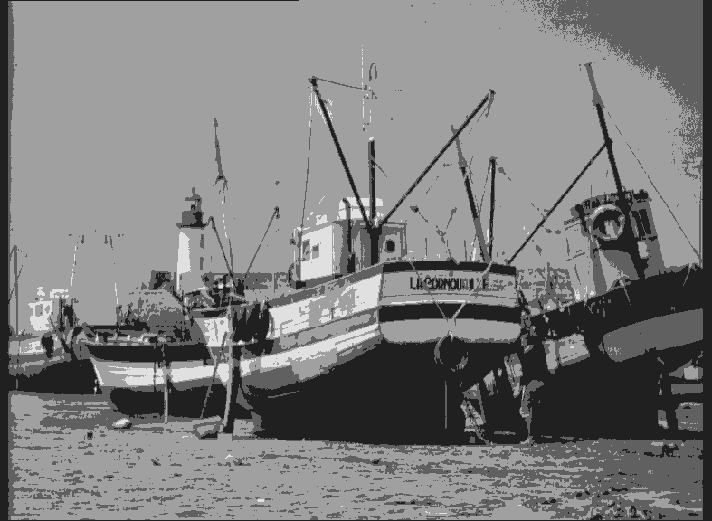

# Problem3 report
## Author: Marko Huljak

Za vrijednost faktora  q=1  vidimo da slika ima najmanje 'grupa' nijansi sive boje,  
te je stoga kvantizacija najuočljivija u usporedbi sa ostalim slikama. Za q=2  prisutan 
je veći broj nijansi sive te se na slici lakše prepoznaju brodovi. Faktori q=3 i q=4 nam 
jasnije opisuju sliku, ali se još uvijek vide drastični prijelazi nijansa sive boje. Faktor 
q=5 nam omogućuje dovoljan broj nijansi sive te možemo reći da je kvaliteta slike 
prihvatljiva. Između faktora q=6, q=7 i q=8 zapravo ni ne vidimo razliku jer ljudsko oko 
ne razlikuje cijeli raspon nijansa sive boje. Možemo zaključiti da se povećavanjem 
faktora q povećava kvaliteta slike, te se kvantizacija sve manje i manje primjećuje.  

### q=1

### q=2

### q=3

### q=4

### q=5

### q=6

### q=7

### q=8

